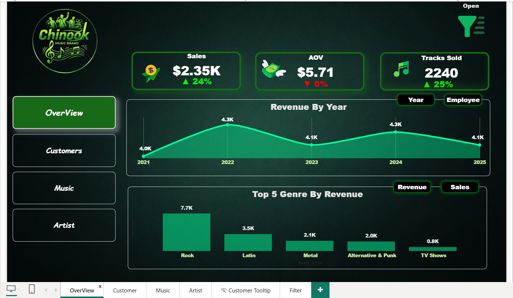
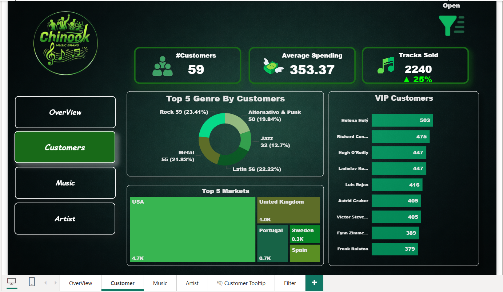
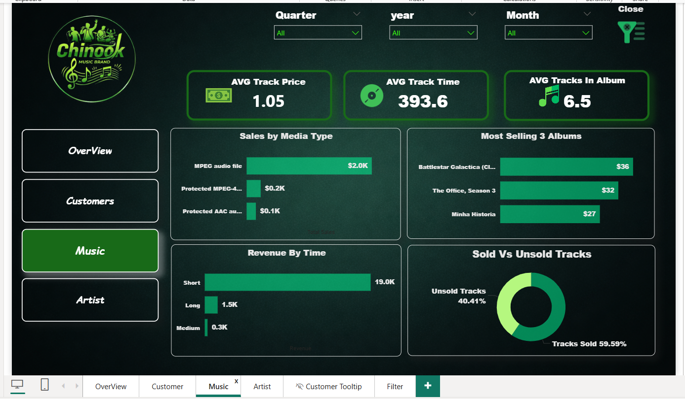
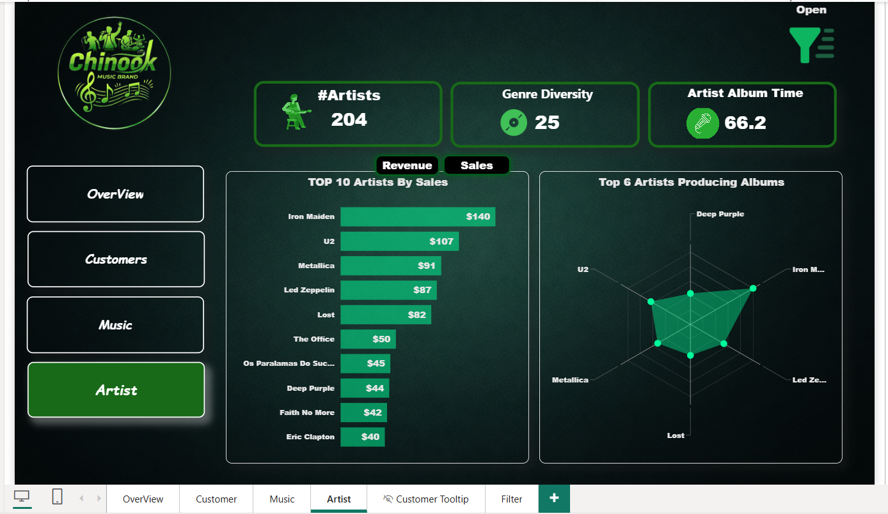

# 🎵 Music Store Product Analysis

## 📌 Project Overview
A comprehensive product performance analysis for **Chinook Music Brand** using Power BI.
The project identifies top-selling and underperforming products, analyzes customer segments,
and tracks revenue trends across multiple years to support data-driven business decisions.

## 🎯 Objectives
- Identify top-selling and underperforming music products
- Analyze customer segments and VIP customers by spending
- Track revenue trends across years and music genres
- Evaluate artist performance and album sales

## 🛠️ Tools & Technologies
| Tool | Purpose |
|------|---------|
| Power BI | Data Visualization & Dashboard |
| SQL | Data Extraction & Querying |
| Figma | Dashboard UI Design & Prototyping |

## 📊 Key Findings
- **Rock** is the top genre by revenue generating **$7.7K**
- **59.59%** of tracks were sold while **40.41%** remain unsold
- **Iron Maiden** is the top artist by sales with **$140** revenue
- **USA** is the largest market with **4.7K** in sales
- Total of **2,240 tracks sold** with a **25% growth** rate

## 📸 Dashboard Preview

### 🏠 Overview Page

### 👥 Customers Page

### 🎵 Music Page

### 🎸 Artist Page

## 👤 Author
**Ramez Reda** — Data Analyst

